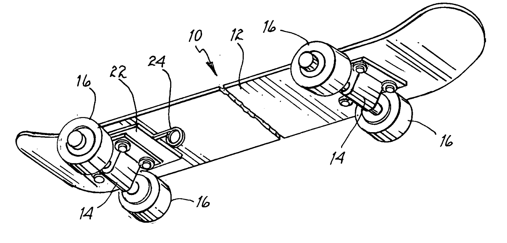

# Framework Front-End I - Angular

## O que é?

Angular é um **_framework_** JavaScript, de código aberto, mantido pela Google para a construção de **_SPA_** (sigla para Single Page Applications ou Aplicações de Página Única).

Angular é uma reescrita completa do AngularJS, feito pela mesma equipe que o construiu.

---

## O que é framework?

> Framework é uma definição que vai além do mercado de software. Em outros contextos, refere-se a uma série de ações e estratégias que visam solucionar um problema bem específico. (NOLETO, Cairo. Em 13/02/2020)

Trazendo essa definição para a área de tecnologia, podemos definir como um conjunto de recursos prontos que nos oferecem algumas funcionalidades ou a estrutura para desenvolvermos essas funcionalidades.

---

## O que é uma SPA?

Single Page Applications que, em tradução literal, é Aplicações de Página Única, como o próprio nome sugere, são aplicações cujas funcionalidades estão concentradas em uma única página.

Quando interagimos com as página ou navegamos entre elas, ao invés de carregar todo o conteúdo, ela atualiza apenas a parte desejada, por isso a definição de página única.

---

## Angular CLI

A CLI Angular é uma ferramenta de interface de linha de comando que você usa para inicializar, desenvolver, estruturar e manter aplicativos Angular diretamente de um shell de comando.

1. Instalar o NodeJs (https://nodejs.org/en/download/)
2. Instalar a Angular CLI: `npm i -g @angular/cli@16.2.13`

---

## Arquitetura de componentes

É uma arquitetura baseada em componentes independentes, substituíveis e modulares que facilitam o gerenciamento da complexidade e encorajam a reutilização.

---

## Por que componentizar?

1. O problema é dividido em porções menores e mais expressivas.
2. Componentes geralmente representam diferenças nas taxas de mudança de diferentes partes do sistema e têm ciclos de vida diferentes.
3. Eles incentivam a definição e manutenção de um delineamento claro de responsabilidade, o que por sua vez limita o impacto de mudanças e torna o entendimento e a alteração da base de código mais simples.
4. Eles podem dar um grau maior de liberdade na otimização do processo de compilação e implantação.

---

## Vamos componentizar?



---

## Configurando o bootstrap

Para poder utilizar os estilos do Bootstrap em sua aplicação Angular, são necessários os seguintes passos:

1. Instalar o Bootstrap e Bootstrap Icons:

`npm install bootstrap`

2. No arquivo `angular.json`, adicionar a referência aos paths das bibliotecas instaladas:

```js
  "styles": [
    "node_modules/bootstrap/scss/bootstrap.scss",
    "src/styles.scss"
  ],
  "scripts": [
    "node_modules/bootstrap/dist/js/bootstrap.bundle.min.js"
  ]
```

---

## Databinding

De forma simplificada, databinding significa comunicação, comunicação entre o template (HTML) e o código TypeScript (lógica de negócio).

Essa comunicação pode se dar de três formas:

- Dados do TypeScript para o template HTML (interpolação de string ou property binding);

- Dados do template para o TypeScript (event binding);

- Ou, ainda, combinando as duas formas anteriores (two-way-binding)

---

## Interpolação de string

Através da interpolação de string, podemos exibir no template qualquer valor que se resolva como uma string. Assim, podemos exibir, tanto o valor de uma variável, quanto o retorno de uma função que retorne uma string.

Vamos à pratica!

---

## Property binding

Com o property binding, podemos alterar dinamicamente o comportamento dos elementos no template.

Let's go!

---

## Event binding

Até agora vimos como enviar dados do TypeScript para o template. Agora vamos ver o inverso.

Imagine um botão, que ao ser clicado, espera-se que determinado comportamento ocorra. Para isso, usamos o event binding, através do qual podemos emitir eventos do template HTML para o TypeScript.

Vamos ver na prática!

---

## Two-way-binding

O two-way-binding nos permite combinar a comunicação em duas vias. Com o two-way-binding, podemos, ao mesmo tempo que enviamos dados do TypeScript para HTML, realizar o inverso. Dessa forma, temos sempre os dois lados com a informação atualizada.

Vamos testar isso na prática!

---

## Diretivas

As diretivas são as funções que serão executadas sempre que o compilador do Angular as encontrar. Elas aprimoram a capacidade dos elementos do HTML anexando comportamentos personalizados ao DOM.

As diretivas, no Angular, podem ser de três tipos:

- Diretivas de atributo

- Diretivas estruturais

- Componentes

---

### Diretivas de atributo

As diretivas de atributo fornecem a possibilidade de manipular a aparência e alguns comportamentos dos elementos do DOM.

As diretivas de atributo mais comuns são `NgStyle` e `NgClass`.

---

### Diretivas estruturais

As diretivas estruturais, como o nome sugere, são responsáveis por alterar a estrutura dos elementos do DOM. Podem adicionar ou remover elementos dinamicamente.

As diretivas estruturais mais populares são `NgIf`, `NgFor` e `NgSwitch.`

---

## Diretivas customizadas

Vimos anteriormente as principais diretivas do Angular e que podem ser diretivas de atributo (`NgStyle` e `NgClass`) ou diretivas estruturais (`NgIf`, `NgFor` e `NgSwitch.`).

Agora, vamos criar nossas próprias diretivas...

---

## Referências e links úteis

- [Documentação Angular](https://angular.io/docs)

- [O que é o Angular e para que serve?](https://www.treinaweb.com.br/blog/o-que-e-o-angular-e-para-que-serve)

- [Framework: o que é, como ele funciona e para que serve?](https://blog.betrybe.com/framework-de-programacao/o-que-e-framework/)

- [Já ouviu falar em Single Page Applications?](https://www.devmedia.com.br/ja-ouviu-falar-em-single-page-applications/39009)

- [Angular CLI](https://angular.io/cli)

- [O que é componentização](https://hnz.com.br/o-que-e-componentizacao/)

- [Como usar seus componentes Angular em qualquer lugar](https://blog.wgbn.com.br/como-usar-seus-componentes-angular-em-qualquer-lugar-3ef1d57c117e)

- [Como adicionar Bootstrap a um aplicativo Angular](https://www.freecodecamp.org/news/how-to-add-bootstrap-css-framework-to-an-angular-application/)

- [Binding syntax](https://angular.io/guide/binding-syntax)

- [Como usar e criar diretivas personalizadas no Angular](https://www.freecodecamp.org/portuguese/news/como-usar-e-criar-diretivas-personalizadas-no-angular/)
